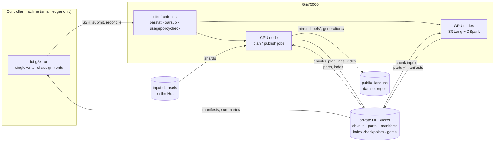

# Architecture

## Layers

| Package | Role | May import |
|---|---|---|
| `landuse_filter.domain` | Pure logic: parsing, metrics, the non-inferiority gate, planning, completion, usage policy, OAR arguments, slot ranking | stdlib, numpy |
| `landuse_filter.adapters` | I/O: dataset readers, tokenizer, SGLang engine, SSH/OAR, HF Bucket, Hub, parquet store | domain |
| `landuse_filter.application` | Use cases: plan, run a node, controller cycle, gate, publish | domain, adapters |
| `landuse_filter.cli` | `luf` commands: parse options, call a use case | everything |

Import-linter contracts and an AST test (`tests/architecture`) enforce the layers.

The package does not import `adapters/frontend/`. The project copies its scripts (the GPU inventory)
to a Grid'5000 frontend and runs them there. The scripts use only stdlib
because the project is not installed on the frontend.

## Data flow

## Identities

| Name | Definition | Used for |
|---|---|---|
| `text_sha256` | sha256 of the exact sentence bytes | dedup: the project generates each unique text one time |
| `label_id` | sha256 of dataset + join keys | primary key of `labels/` |
| `generation_id` | sha256 of `text_sha256` + fingerprint | primary key of `generations/` |
| `config_fingerprint` | the configuration that changes the output (model, draft, revisions, prompt, template kwargs, sampling, engine) | cache and namespace identity |
| `serving_fingerprint` | the full configuration, with the speed arguments | what a gate approves |
| namespace | `<fp>` (production), `<fp>-gpu-<key>` (admission), `<fp>-w<N>` (tuning) | keeps candidate results apart |

A chunk id is the sha256 of the fingerprint and its sorted text hashes. The name of a part is the sha256 of its bytes.

## Resumability

| Failure | Result |
|---|---|
| The walltime ends a job, or the scheduler preempts a job. | Flushed parts already hold the completed requests. The next job generates only the missing hashes. |
| The controller stops during a submission. | The controller writes the assignment before `oarsub`. After a restart, the controller adopts the job by name. |
| A waiting job starts too late. | The controller cancels the job and backs off the cluster. The chunks of the job return to the pool. |
| A part is corrupt. | The controller finds it when it hashes the part again and does the work again. A rewrite with the same name repairs the part. |
| A planning job stops. | The job resumes from the index checkpoint in the bucket. |

Tests cover each row in `tests/acceptance/features/resume.feature` and
`tests/unit/test_controller.py`.
