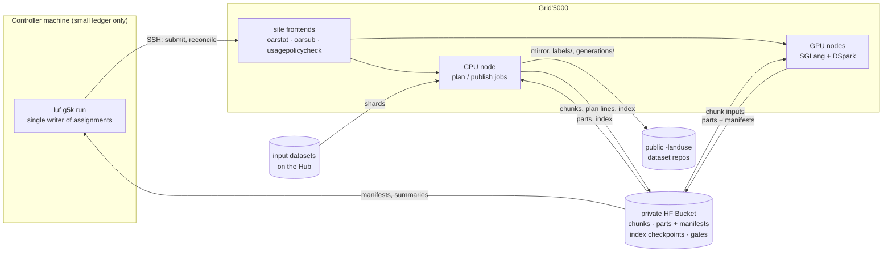

# Architecture

## Layers

| Package | Role | May import |
|---|---|---|
| `landuse_filter.domain` | Pure logic: parsing, metrics, the non-inferiority gate, planning, completion, usage policy, OAR arguments, slot ranking | stdlib, numpy |
| `landuse_filter.adapters` | I/O: dataset readers, tokenizer, SGLang engine, SSH/OAR, HF Bucket, Hub, parquet store | domain |
| `landuse_filter.application` | Use cases: plan, run a node, controller cycle, gate, publish | domain, adapters |
| `landuse_filter.cli` | `luf` commands: parse options, call a use case | everything |

The layering is enforced by import-linter contracts and an AST test (`tests/architecture`).

## Data flow

## Identities

| Name | Definition | Used for |
|---|---|---|
| `text_sha256` | sha256 of the exact sentence bytes | dedup: each unique text is generated once |
| `label_id` | sha256 of dataset + join keys | primary key of `labels/` |
| `generation_id` | sha256 of `text_sha256` + fingerprint | primary key of `generations/` |
| `config_fingerprint` | output-affecting config (model, draft, revisions, prompt, template kwargs, sampling, engine) | cache and namespace identity |
| `serving_fingerprint` | full config, speed args included | what a gate approves |
| namespace | `<fp>` (production), `<fp>-gpu-<key>` (admission), `<fp>-w<N>` (tuning) | keeps candidate results apart |

A chunk id is the sha256 of the fingerprint plus its sorted text hashes. A part's
name is the sha256 of its bytes.

## Resumability

| Failure | What happens |
|---|---|
| Job killed at walltime or preempted | Completed requests are already in flushed parts; the next job regenerates only the missing hashes. |
| Controller killed mid-submission | The assignment is written before `oarsub`; the job is adopted by name on restart. |
| Waiting job drifts late | The job is cancelled and the cluster backed off; its chunks return to the pool. |
| Corrupt part | Detected by re-hashing and redone; a same-named rewrite repairs it. |
| Planning job killed | It resumes from the index checkpoint in the bucket. |

Each row is covered by tests in `tests/acceptance/features/resume.feature` and
`tests/unit/test_controller.py`.
